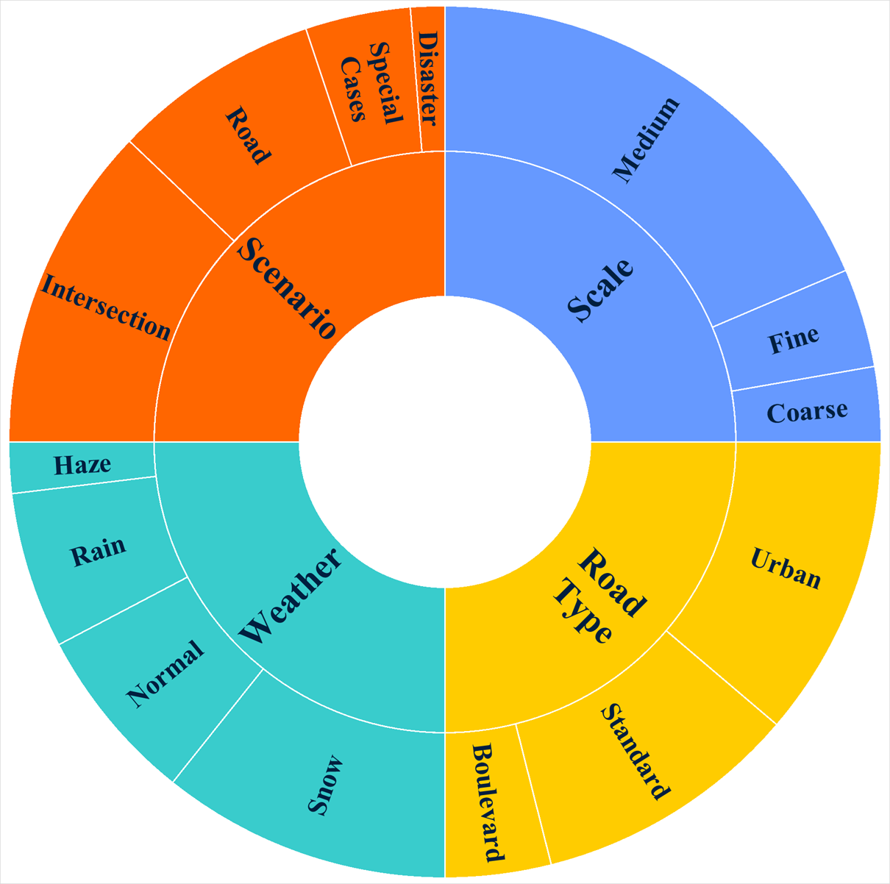
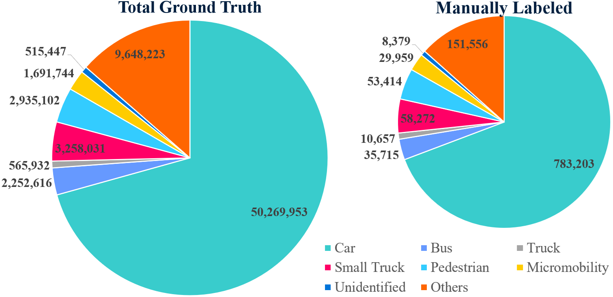
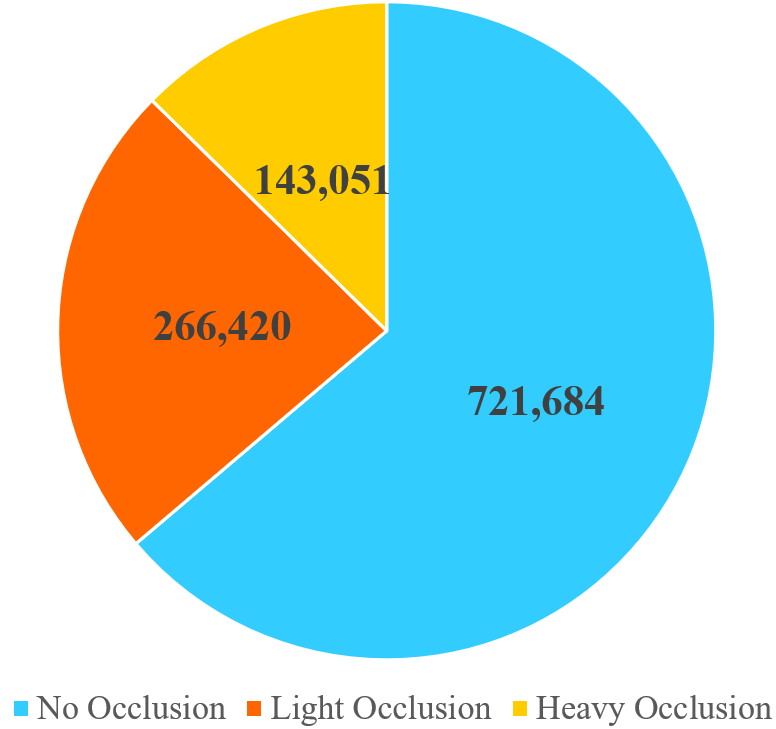
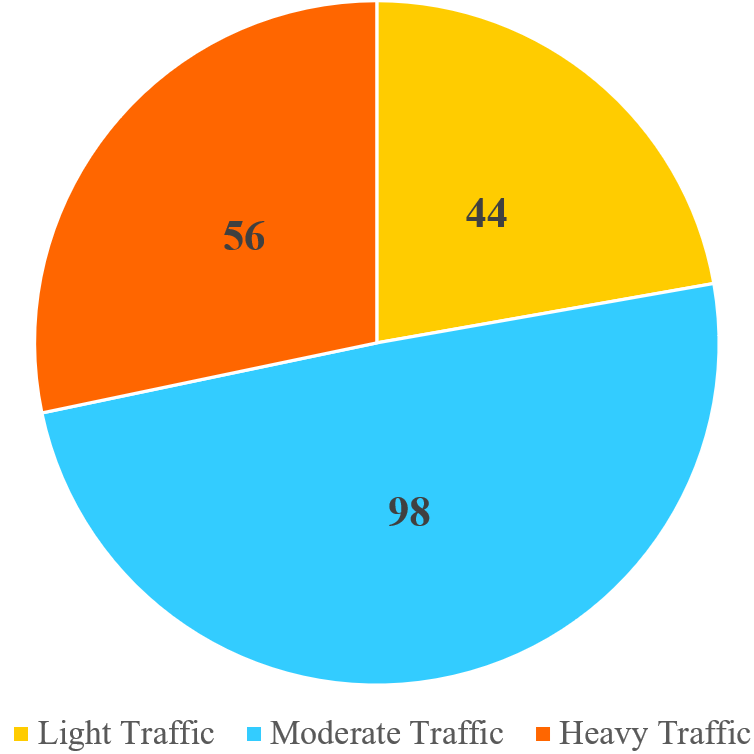
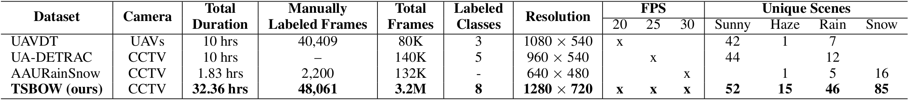
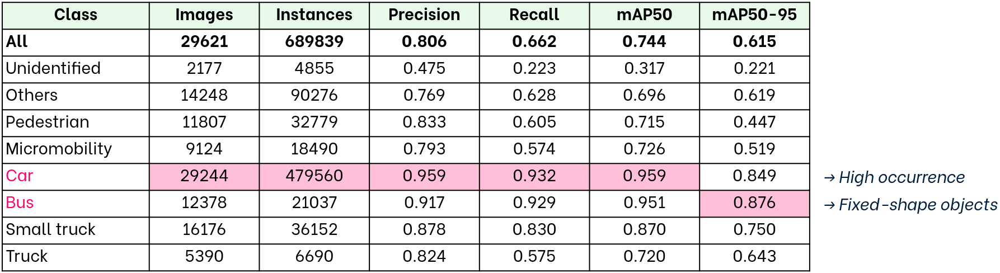
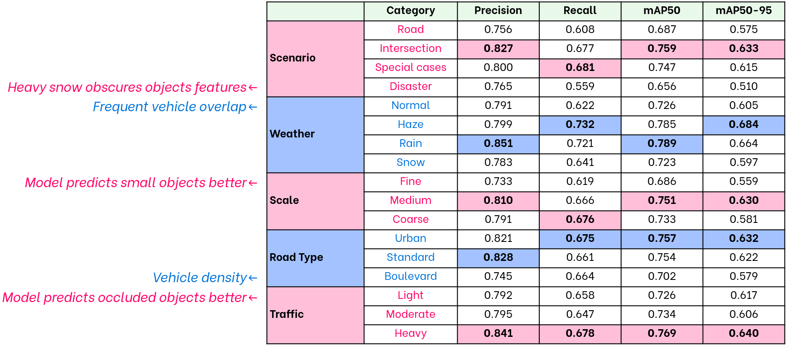

<!-- 
__        _______ _     ____ ___  __  __ _____ 
\ \      / / ____| |   / ___/ _ \|  \/  | ____|
 \ \ /\ / /|  _| | |  | |  | | | | |\/| |  _|  
  \ V  V / | |___| |__| |__| |_| | |  | | |___ 
   \_/\_/  |_____|_____\____\___/|_|  |_|_____|
                                   
 _____ ___  
|_   _/ _ \ 
  | || | | |
  | || |_| |
  |_| \___/ 
            

 _____ ____  ____   _____        __
|_   _/ ___|| __ ) / _ \ \      / /
  | | \___ \|  _ \| | | \ \ /\ / / 
  | |  ___) | |_) | |_| |\ V  V /  
  |_| |____/|____/ \___/  \_/\_/   
                                   
-->
                              

<h1 align='center'>
    TSBOW: Traffic Surveillance Benchmark<br> for Occluded Vehicles
    <br> Under Various Weather Conditions
</h1>


<!-- MARK: authors -->
<div align='center'>
    <a href="https://scholar.google.com/citations?user=pCTUkWwAAAAJ">
        Ngoc Doan-Minh Huynh</a> &emsp;
    <a href="https://scholar.google.com/citations?user=crRQGUAAAAAJ">
        Duong Nguyen-Ngoc Tran</a>&emsp;
    <a href="https://scholar.google.com/citations?user=xPyle9AAAAAJ">
        Long Hoang Pham</a>   
</div>

<div align='center'>
    Tai Huu-Phuong Tran &emsp;
    Hyung-Joon Jeon     &emsp;
    Huy-Hung Nguyen     &emsp;
    Duong Khac Vu       &emsp;
    Hyung-Min Jeon      
</div>

<div align='center'>
    Son Hong Phan       &emsp; 
    Quoc Pham-Nam Ho    &emsp;
    Chi Dai Tran        &emsp;
    Trinh Le Ba Khanh   &emsp;
    <a href="https://scholar.google.com/citations?user=9z0SfKoAAAAJ">
        Jae Wook Jeon</a>
</div>


<!-- affliation -->
<div align='center'>
    <a href="https://micro.skku.ac.kr/micro/index.do">Automation Lab</a>, Sungkyunkwan University
</div>

<br>

<div align='center'>
    <b>Corresponding Author</b>: jwjeon@skku.edu
    <br>
    <b>Contact for Dataset</b>: {ngochdm, duongtran, phlong}@skku.edu
</div>


<!-- MARK: URLs -->
<!-- get img shields at: -->
<!-- https://shields.io/badges -->
<!-- check icon at: -->
<!-- https://github.com/simple-icons/simple-icons/blob/master/slugs.md  -->
<br> 

<div align="center">
  <a href="https://skkuautolab.github.io/TSBOW/"></a>  
  <a href="https://aaai.org/conference/aaai/aaai-26/"></a>  
  <a href="https://aaai.org/conference/aaai/aaai-26/"></a>  
  <br>
  <!-- <a href="https://docs.google.com/presentation/d/1Wd2alQk565YBZjTaoVdSrdDacb_ILhlXTOzTTP_tTt4/edit?usp=sharing"></a>    -->
  <a href="https://github.com/SKKUAutoLab/TSBOW"></a>   
  <a href="https://huggingface.co/datasets/SKKUAutoLab/TSBOW"></a>  
</div>

<br>

**(UPDATING....)**

(All links would be updated **on the conference day.**)

Please download our Github repo to get better markdown view (i.e. Visual Code).


<!-- MARK: News -->

## 🎉 NEWS

<!-- + [2026.01.20] 🎆 TSBOW dataset is available on HuggingFace. -->
<!-- + [2025.12.31] 🔥 Our paper, code and TSBOW dataset are released! -->

+ [2025.11.16] 🔥 Our code and website are released!
+ [2025.11.08] 🎉 **<span style="color: #FFCC00">T</span><span style="color: #33CCCC">S</span><span style="color: #FF6600">B</span><span style="color: #6699FF">O</span><span style="color: #FF0066">W</span>** has been accepted to **AAAI 2026**!


<!-- MARK: Abstract -->

## 📝 Abstract

Global warming has intensified the frequency and severity of extreme weather events, which degrade CCTV signal and video quality while disrupting traffic flow, thereby increasing traffic accident rates. Existing datasets, often limited to light haze, rain, and snow, fail to capture extreme weather conditions. To address this gap, this study introduces the **T**raffic **S**urveillance **B**enchmark for **O**ccluded Vehicles under Various **W**eather Conditions (**TSBOW**), a comprehensive dataset designed to enhance occluded vehicle detection across diverse annual weather scenarios. Comprising over **32 hours** of real-world traffic data from densely populated urban areas, TSBOW includes more than **48,000 manually annotated** and **3.2 million semi-labeled frames**; bounding boxes spanning eight traffic participant classes from large vehicles to micromobility devices and pedestrians. We establish an object detection benchmark for TSBOW, highlighting challenges posed by occlusions and adverse weather. With its varied road types, scales, and viewpoints, TSBOW serves as a critical resource for advancing Intelligent Transportation Systems. Our findings underscore the potential of CCTV-based traffic monitoring, paving the way for new research and applications. The TSBOW dataset is publicly available at the following link. <br>
**Code** -- https://github.com/SKKUAutoLab/TSBOW


<!-- MARK: Overview -->

## 🌍 Overview

<div align="center" style="max-width:900px; margin: 10px auto 20px; border-radius: 8px;">
    
    <p><b>Dataset Statistics</b></p>
</div>


<div align="center" style="max-width:1000px; margin: 10px auto 20px;">
    <div style="display:flex; gap:18px; justify-content:center; align-items:flex-start; flex-wrap:wrap;">
        <div style="flex:1 1 440px; max-width:51%; text-align:center;">
            
            <p style="margin:8px 0 0 0; font-weight:600;">Recording Locations</p>
        </div>
        <div style="flex:1 1 440px; max-width:42%; text-align:center;">
            
            <p style="margin:8px 0 0 0; font-weight:600;">Video Distribution</p>
        </div>
    </div>
</div>


<details>
    <summary>Other Distributions</summary>

<!-- Class Distribution -->
<div align="center" style="max-width:900px; margin: 10px auto 20px; border-radius: 8px;">
    
    <p><b>Class Distribution</b></p>
</div>

<!-- Occlusion and Traffic Distribution -->
<div align="center" style="max-width:1000px; margin: 10px auto 20px;">
    <div style="display:flex; gap:18px; justify-content:center; align-items:flex-start; flex-wrap:wrap;">
        <div style="flex:1 1 440px; max-width:48%; text-align:center;">
            
            <p style="margin:8px 0 0 0; font-weight:600;">Occlusion Ditribution</p>
        </div>
        <div style="flex:1 1 440px; max-width:45%; text-align:center;">
            
            <p style="margin:8px 0 0 0; font-weight:600;">Traffic Distribution</p>
        </div>
    </div>
</div>

</details>

<!-- Table 2x3 for github -->
<!-- <div align="center">
    <table style="width: 100%; max-width: 800px; margin: 30px auto; border-collapse: collapse;">
        <tr>
            <td style="padding: 25px 15px; text-align: center; border: 1px solid #ddd; background: #092030;">
                <h2 style="margin: 0; font-size: 2.5em; color: #33CCCC; font-weight: bold;">198</h2>
                <p style="margin: 8px 0 0 0; font-size: 1.1em; color: #33CCCC; font-weight: bold;">📹 Processed Videos 📹</p>
            </td>
            <td style="padding: 25px 15px; text-align: center; border: 1px solid #ddd; background: #092030;">
                <h2 style="margin: 0; font-size: 2.5em; color: #FFCC00; font-weight: bold;">32 h</h2>
                <p style="margin: 8px 0 0 0; font-size: 1.1em; color: #FFCC00; font-weight: bold;">⏱️ Duration ⏱️</p>
            </td>
            <td style="padding: 25px 15px; text-align: center; border: 1px solid #ddd; background: #092030;">
                <h2 style="margin: 0; font-size: 2.5em; color: #6699FF; font-weight: bold;">3.2 M</h2>
                <p style="margin: 8px 0 0 0; font-size: 1.1em; color: #6699FF; font-weight: bold;">🖼️ Total Frames 🖼️</p>
            </td>
        </tr>
        <tr>
            <td style="padding: 25px 15px; text-align: center; border: 1px solid #ddd; background: #092030;">
                <h2 style="margin: 0; font-size: 2.5em; color: #FF6600; font-weight: bold;">71.1 M</h2>
                <p style="margin: 8px 0 0 0; font-size: 1.1em; color: #FF6600; font-weight: bold;">Semi-Annotated<br>Instances</p>
            </td>
            <td style="padding: 25px 15px; text-align: center; border: 1px solid #ddd; background: #092030;">
                <h2 style="margin: 0; font-size: 2.5em; color: #33CCFF; font-weight: bold;">48 K</h2>
                <p style="margin: 8px 0 0 0; font-size: 1.1em; color: #33CCFF; font-weight: bold;">Manual-Annotated<br>Frames</p>
            </td>
            <td style="padding: 25px 15px; text-align: center; border: 1px solid #ddd; background: #092030;">
                <h2 style="margin: 0; font-size: 2.5em; color: #FF0066; font-weight: bold;">1.1 M</h2>
                <p style="margin: 8px 0 0 0; font-size: 1.1em; color: #FF0066; font-weight: bold;">Manual-Anotated<br>Instances</p>
            </td>
        </tr>
    </table>
</div> -->

<!-- Table 1x6 for poster -->
<!-- <div align="center">
    <table style="width: 100%; max-width: 1100px; margin: 30px auto; border-collapse: collapse;">
        <tr>
            <td style="padding: 25px 15px; text-align: center; border: 1px solid #ddd; background: #092030;">
                <h2 style="margin: 0; font-size: 2.5em; color: #33CCCC; font-weight: bold;">198</h2>
                <p style="margin: 8px 0 0 0; font-size: 1.1em; color: #33CCCC; font-weight: bold;">Processed Videos<br>📹</p>
            </td>
            <td style="padding: 25px 15px; text-align: center; border: 1px solid #ddd; background: #092030;">
                <h2 style="margin: 0; font-size: 2.5em; color: #FFCC00; font-weight: bold;">32 h</h2>
                <p style="margin: 8px 0 0 0; font-size: 1.1em; color: #FFCC00; font-weight: bold;">Duration<br>⏱️</p>
            </td>
            <td style="padding: 25px 15px; text-align: center; border: 1px solid #ddd; background: #092030;">
                <h2 style="margin: 0; font-size: 2.5em; color: #6699FF; font-weight: bold;">3.2 M</h2>
                <p style="margin: 8px 0 0 0; font-size: 1.1em; color: #6699FF; font-weight: bold;">Total Frames<br>🖼️</p>
            </td>
            <td style="padding: 25px 15px; text-align: center; border: 1px solid #ddd; background: #092030;">
                <h2 style="margin: 0; font-size: 2.5em; color: #FF6600; font-weight: bold;">71.1 M</h2>
                <p style="margin: 8px 0 0 0; font-size: 1.1em; color: #FF6600; font-weight: bold;">Semi-Annotated<br>Instances</p>
            </td>
            <td style="padding: 25px 15px; text-align: center; border: 1px solid #ddd; background: #092030;">
                <h2 style="margin: 0; font-size: 2.5em; color: #33CCFF; font-weight: bold;">48 K</h2>
                <p style="margin: 8px 0 0 0; font-size: 1.1em; color: #33CCFF; font-weight: bold;">Manual-Annotated<br>Frames</p>
            </td>
            <td style="padding: 25px 15px; text-align: center; border: 1px solid #ddd; background: #092030;">
                <h2 style="margin: 0; font-size: 2.5em; color: #FF0066; font-weight: bold;">1.1 M</h2>
                <p style="margin: 8px 0 0 0; font-size: 1.1em; color: #FF0066; font-weight: bold;">Manual-Anotated<br>Instances</p>
            </td>
        </tr>
    </table>
</div> -->


<!-- MARK: Datasets -->

## 📊 Datasets

<details>
    <summary>Comparison with other datasets</summary>
    
<div align="center" style="background:#f4f7fb; padding:18px; border-radius:10px; max-width:1000px; margin: 16px auto;">
    
</div>
<p align="center" style="margin:8px 0 0 0; font-weight:600;">Comparison with other datasets about weather conditions and scales</p>

</details> <br>

| Dataset           | Introduction                      |  Pub  | Paper |
|:---:              |:---                               | :---: | :--- |
| **UAVDT**         <br>[[website]](https://datasetninja.com/uavdt)| - *<span style="color: #FFCC00">Hardware</span>*: UAVs. <br> - *<span style="color: #33CCCC">Tasks</span>:* object detection, single object tracking, multiple-object tracking. <br> - *<span style="color: #FF6600">Position</span>:* China. <br> - *<span style="color: #6699FF">Weather</span>:* sunny/cloudy, fog, rain. <br> - *<span style="color: #FF0066">Time</span>:* day, night. | IJCV <br> 2020 | The Unmanned Aerial Vehicle Benchmark: Object Detection, Tracking and Baseline |
| **UA-DETRAC**     <br>[[website]](https://sites.google.com/view/daweidu/projects/ua-detrac?authuser=0)| - *<span style="color: #FFCC00">Hardware</span>*: Cannon EOS 550D camera. <br> - *<span style="color: #33CCCC">Tasks</span>:* object detection, multi-object tracking. <br> - *<span style="color: #FF6600">Position</span>:* China. <br> - *<span style="color: #6699FF">Weather</span>:* sunny/cloudy, rain. <br> - *<span style="color: #FF0066">Time</span>:* day, night. | CVIU <br> 2020 | UA-DETRAC: A new benchmark and protocol for multi-object detection and tracking |
| **AAU RainSnow**  <br>[[website]](https://vbn.aau.dk/en/datasets/aau-rainsnow-traffic-surveillance-dataset/)| - *<span style="color: #FFCC00">Hardware</span>*: RGB color and thermal camera. <br> - *<span style="color: #33CCCC">Tasks</span>:* instance segmentation, single object tracking, multiple-object tracking. <br> - *<span style="color: #FF6600">Position</span>:* Denmark. <br> - *<span style="color: #6699FF">Weather</span>:* fog, rain, snow. <br> - *<span style="color: #FF0066">Time</span>:* day, night. | ITS <br> 2019 | Rain Removal in Traffic Surveillance: Does it Matter? |
| **<span style="color: #FFCC00">T</span><span style="color: #33CCCC">S</span><span style="color: #FF6600">B</span><span style="color: #6699FF">O</span><span style="color: #FF0066">W</span>**             <br>[[website]](https://skkuautolab.github.io/TSBOW/)| - *<span style="color: #FFCC00">Hardware</span>*: CCTV system + color camera. <br> - *<span style="color: #33CCCC">Tasks</span>:* object detection. <br> - *<span style="color: #FF6600">Position</span>:* South Korea. <br> - *<span style="color: #6699FF">Weather</span>:* sunny/cloudy, haze, rain, snow. <br> - *<span style="color: #FF0066">Time</span>:* day. <br> (night-time and other tasks will be updated later) | AAAI <br> 2026 | TSBOW: Traffic Surveillance Benchmark for Occluded Vehicles Under Various Weather Conditions |


<!-- MARK: Baselines -->

## 📉 Baselines

|  Year |  Pub    | Paper                            | Link  | Note |
| :---: |  :---:  | :---                             |:---:  | :--- |
| 2024  |  ICDICI | A review on yolov8 and its advancements | [paper](https://link.springer.com/chapter/10.1007/978-981-99-7962-2_39) | YOLOv8 |
| 2024  |  arXiV  | YOLOv11: An Overview of the Key Architectural Enhancements | [paper](https://arxiv.org/abs/2410.17725) | YOLOv11 |
| 2024  |  CVPR   | DETRs Beat YOLOs on Real-time Object Detection | [paper](https://openaccess.thecvf.com/content/CVPR2024/html/Zhao_DETRs_Beat_YOLOs_on_Real-time_Object_Detection_CVPR_2024_paper.html) | RT-DETR |
| 2025  |  arXiV  | A Breakdown of the Key Architectural Features | [paper](https://arxiv.org/abs/2502.14740) | YOLOv12 |


The source codes for baseline models are provided in [Baselines](baselines/) folder. 
Read [Instruction](baselines/README.md) for more information.


<!-- MARK: Experiments -->

## ⚗️ Experiments

<div align="center" style="background:#f4f7fb; padding:5px; border-radius:10px; max-width:1000px; margin: 16px auto;">
    
</div>
<p align="center" style="margin:8px 0 0 0; font-weight:600;">Model performances after training 100 epochs and validating with imgsz=1280 on manually labeled test set. </p>

<div align="center" style="background:#f4f7fb; padding:18px; border-radius:10px; max-width:1000px; margin: 16px auto;">
    
</div>
<p align="center" style="margin:8px 0 0 0; font-weight:600;"> Model performances under different weather conditions </p>


<!-- Comparison with other datasets -->
<details>
    <summary>Comparison with other datasets</summary>

<div align="center" style="background:#f4f7fb; padding:18px; border-radius:10px; max-width:1000px; margin: 16px auto;">
    
</div>
<p align="center" style="margin:8px 0 0 0; font-weight:600;">Model performances when training on different datasets </p>

<div align="center" style="background:#f4f7fb; padding:5px; border-radius:10px; max-width:1000px; margin: 16px auto;">
    
</div>
<p align="center" style="margin:8px 0 0 0; font-weight:600;">Comparison of traffic surveillance datasets </p>

<div align="center" style="background:#f4f7fb; padding:5px; border-radius:10px; max-width:1000px; margin: 16px auto;">
    
</div>
<p align="center" style="margin:8px 0 0 0; font-weight:600;">Models performance for <i>car</i> across different metrics on <b>the comparison set</b> </p>

</details>


<!-- Ablation Studies -->
<details>
    <summary>Ablation Studies</summary>

<div align="center" style="background:#f4f7fb; padding:3px; max-width:1000px; margin: 16px auto;">
    
</div>
<p align="center" style="margin:8px 0 0 0; font-weight:600;">YOLOv12x performance across different classes. </p>

<div align="center" style="background:#f4f7fb; padding:3px; max-width:1000px; margin: 16px auto;">
    
</div>
<p align="center" style="margin:8px 0 0 0; font-weight:600;">Influence of dataset characteristics on object detection performance.</p>

</details>


<!-- MARK: Download -->

## ⬇️ Dataset Download

(Upcoming) We will provide **Terms and Conditions** before downloading our **<span style="color: #FFCC00">T</span><span style="color: #33CCCC">S</span><span style="color: #FF6600">B</span><span style="color: #6699FF">O</span><span style="color: #FF0066">W</span>** dataset.

<details>
    <summary><b>Submission Guidelines</b></summary>
    We will provide the guidelines soon.
</details>
<br>

(Upcoming) Scripts to download **<span style="color: #FFCC00">T</span><span style="color: #33CCCC">S</span><span style="color: #FF6600">B</span><span style="color: #6699FF">O</span><span style="color: #FF0066">W</span>** from HuggingFace will be provided. Please refer to the [`download_TSBOW.py`](utils/download_TSBOW.py) script for more details.


<!-- MARK: References -->

## 📚 References

Thanks to the developers and contributors of the following open-source repositories, whose invaluable work has greatly inspire our project:

**Datasets**:
- [UAVDT](https://datasetninja.com/uavdt): A traffic dataset contains drone footages under sunny and rainy conditions.
- [UA-DETRAC](https://sites.google.com/view/daweidu/projects/ua-detrac?authuser=0): A traffic surveillance dataset captures sunny and rainy weather.
- [AAU RainSnow](https://vbn.aau.dk/en/datasets/aau-rainsnow-traffic-surveillance-dataset/): A traffic surveillance dataset provides segmentation annotations for rain and snow weather.

**Github Repo**:
- [X-AnyLabeling](https://github.com/CVHub520/X-AnyLabeling): An open-source tool for precise bounding box creation.
- [Ultralytics YOLO](https://github.com/ultralytics/ultralytics): Detection models for training and real-time inferencing.
- [YOLOv12](https://github.com/sunsmarterjie/yolov12): A model for object detection.

Our repository is licensed under the **Apache 2.0 License**. However, if you use other components in your work, please follow their license.


<!-- MARK: Citation -->

## 🏅 Citation

**If our research is helpful to you, please cite our paper using the following BibTeX format**

```bibtex
@article{Huynh_TSBOW_AAAI_2026,
    title   = {TSBOW: Traffic Surveillance Benchmark for Occluded Vehicles Under Various Weather Conditions},
    author  = {Ngoc Doan-Minh Huynh, Duong Nguyen-Ngoc Tran, Long Hoang Pham, Tai Huu-Phuong Tran, Hyung-Joon Jeon, Huy-Hung Nguyen, Duong Khac Vu, Hyung-Min Jeon, Son Hong Phan, Quoc Pham-Nam Ho, Chi Dai Tran, Trinh Le Ba Khanh, Jae Wook Jeon},
    journal = {AAAI 2026},
    year    = {2025}
}
```


<!-- MARK: Git Stats -->

<!--  -->

<!--  -->

<div style="position: relative; display: inline-block;">
  
  
</div>

<div align="center"><a href="#top">🔝 Back to Top</a></div>


<!-- https://search.google.com/search-console/ownership?resource_id=https%3A%2F%2Fskkuautolab.github.io%2FTSBOW%2F -->
<!-- figlet -->